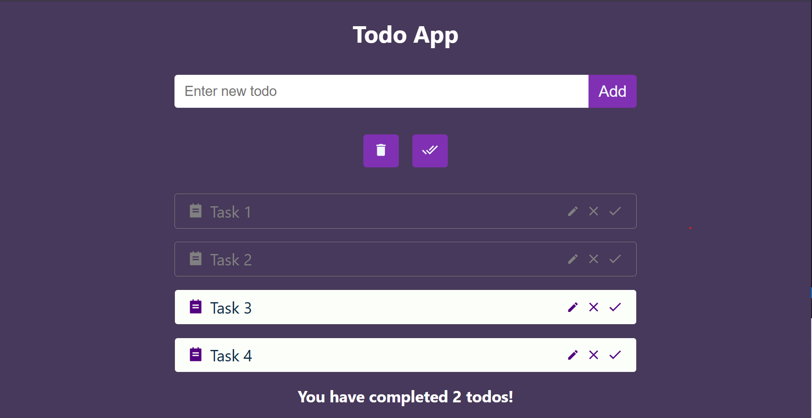

# Todo App

Todo App — это простое приложение для управления списком задач. Оно позволяет пользователю добавлять, удалять, отмечать задачи как выполненные и очищать выполненные задачи. Приложение разработано с использованием React.js.

Todo App is a simple application for managing a list of tasks. It allows the user to add, delete, mark tasks as completed and clear completed tasks. The app is developed using React.js.

## Функционал (Features)

- Добавление новых задач (Add new tasks).
- Удаление выбранной задачи (Deleting a selected task).
- Редактирование выбранноый задачи (Editing a selected task).
- Отметка задачи как выполненной (Marking a task as completed).
- Удаление всех выполненных задач (Deleting all completed tasks).
- Полная очистка списка задач (Completely clearing the task list).
- Отображение сообщений для пустого списка (Display messages for an empty list).
- Отображение количеств выполненных задач (Displaying the number of completed tasks).

## Скриншоты (Screenshots)

### Главный экран (Main Screen):

## Используемые технологии (Used technologies)

- **React.js** — для создания пользовательского интерфейса (for creating user interfaces).
- **HTML5 и CSS3** — для стилизации и разметки (for styling and markup).
- **JavaScript (ES6+)** — для логики приложения (for application logic).

## Установка и запуск (Installation and startup)

1. **Клонируйте репозиторий (Clone the repository)**:
   git clone https://github.com/your-login/todo-app.git
2. **Перейдите в папку проекта (Go to the project folder)**:
   cd todo-app
3. **Установите зависимости (Install the dependencies)**:
   npm install
4. **Запустите приложение (Run the application)**:
   npm start
